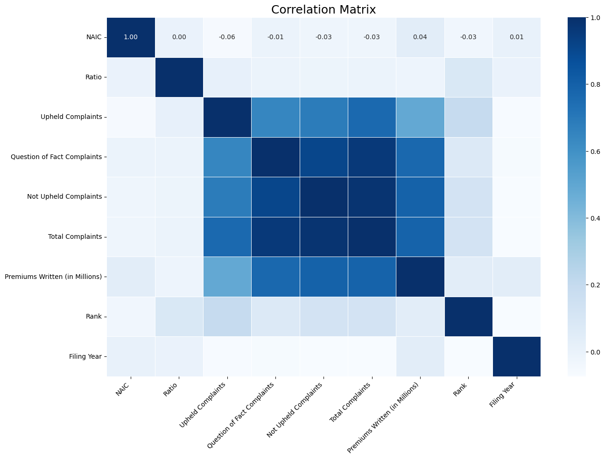

# 🧼 Insurance Data Cleaning Project 🚗💼

Welcome to the **Insurance Data Cleaning Project**! In this project, I conducted a comprehensive data cleaning and exploratory data analysis on a dataset provided by the New York State Department of Financial Services (DFS). The dataset includes information on consumer complaints against automobile insurance companies, focusing on the complaint ratios and the total number of upheld complaints over a two-year period.

## 📋 Project Overview

In this project, I:
- **Load** data 🗂️
- **Clean** data 🧽
- **Explore** data 🔍
- **Visualize** data 📊
- **Analyze** data with machine learning 🤖

## 🛠️ Tools Used

- **Pandas** for data manipulation 🐼
- **NumPy** for numerical operations 🔢
- **Matplotlib** and **Seaborn** for data visualization 📉
- **Scikit-learn** for machine learning 🧠

## 🚀 Features

- **Data Loading and Inspection**: Quickly load and inspect your data.
- **Data Cleaning**: Handle missing values, duplicates, and ensure data consistency.
- **Data Exploration**: Generate univariate and multivariate visualizations.
- **Statistical Analysis**: Perform statistical tests to understand your data better.
- **Machine Learning**: Apply ML algorithms to make predictions.

## 📊 Example Visualization

Here's a sneak peek at one of the visualizations:

## 💡 Insights

- The majority of complaints are Not Upheld Complaints, indicating that many complaints are either resolved or found to be without merit.
- Question of Fact Complaints are significant in number, highlighting the complexity of some disputes in the automobile insurance sector.
- The relatively lower number of Upheld Complaints suggests that most complaints do not result in a finding against the insurance companies.

